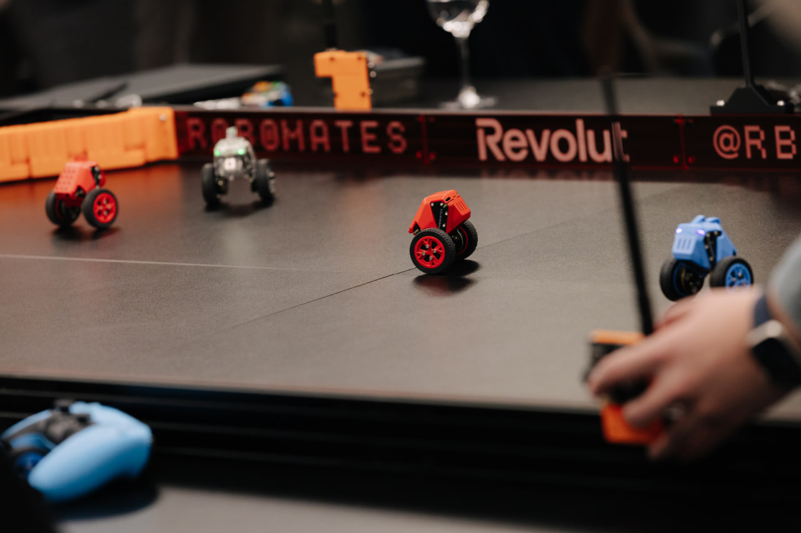

# Robomates

**Self-balancing robots for multiplayer games.**

<p align="center">
  
</p>

Robomates is an open-source robotics platform where small two-wheeled self-balancing robots compete in real-time multiplayer games. Each robot balances on its own, talks to other robots over radio, and is controlled with a Bluetooth gamepad or through a web app — no apps to install, no drivers.

We're also building game objects like bases, gates, and arena walls to make any game imaginable a reality.

---

## What Can It Do?

- **Self-balancing** — each robot stays upright using an IMU and brushless motors with field-oriented control
- **Multiplayer games** — Zombie Tag, Push Wars, Sandbox mode, and more coming soon
- **Gamepad control** — works with PS5, PS4, Xbox, Nintendo Switch Pro, Joy-Con, 8BitDo, and others
- **Web control** — connect from any Chromium browser via [Robomates HQ](https://hq.rbmates.com)
- **Robot-to-robot radio** — sub-GHz communication between all robots on the field
- **Custom melodies** — compose tunes and upload them to the robot's buzzer
- **Programmable behaviors** — create autonomous movement sequences with a visual block editor
- **3D-printable bodies** — choose from multiple shell designs or create your own
- **Hardware security** — every robot has a unique cryptographic identity

## Get Started

1. **Get a kit** — order a complete robot kit or individual parts from [rbmates.com](https://rbmates.com)
2. **Assemble** — follow the step-by-step [Assembly Guide](https://docs.rbmates.com/assembly)
3. **Power on & pair** — insert a battery, flip the switch, and connect your gamepad — see [First Start](https://docs.rbmates.com/first-start)
4. **Play** — open [Robomates HQ](https://hq.rbmates.com) to start a game or explore developer tools

## Flashing Firmware

**Option A — from the browser:**
Open [Robomates HQ](https://hq.rbmates.com) → Serial Dev, connect via USB, and flash directly.

**Option B — with PlatformIO:**
```
git clone https://github.com/user/robomates-firmware.git
cd robomates-firmware
pio run -e robot -t upload
```

## Project Links

| | |
|---|---|
| **Documentation** | [docs.rbmates.com](https://docs.rbmates.com) |
| **Web Control Center (HQ)** | [hq.rbmates.com](https://hq.rbmates.com) |
| **3D Models Library** | [3d.rbmates.com](https://3d.rbmates.com) |
| **Shop** | [rbmates.com](https://rbmates.com) |
| **HQ Source Code** | [robomates-web-hq](https://github.com/user/robomates-web-hq) |

## Supported Controllers

PS5 DualSense, PS4 DualShock, Xbox Wireless, Nintendo Switch Pro, Joy-Con, 8BitDo, Steam Controller, Stadia Controller, and more. Full list in the [docs](https://docs.rbmates.com/supported-controllers).

## License

Robomates firmware is licensed under [CC BY-NC-SA 4.0](https://creativecommons.org/licenses/by-nc-sa/4.0/). See [LICENSE](LICENSE) for the full text.
